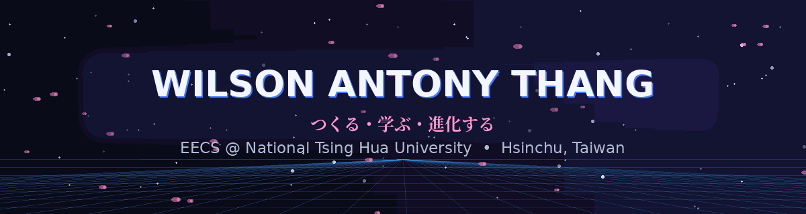
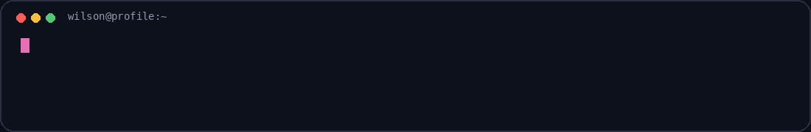

<div align="center">



<br/>

<a href="https://git.io/typing-svg">
  
</a>

<p>
  <a href="mailto:antonywilson229@gmail.com">
    
  </a>
  <a href="https://www.linkedin.com/in/wilson-thang-222075345">
    
  </a>
  <a href="https://github.com/WilsonAnthonyT">
    
  </a>
</p>

**EECS undergraduate @ National Tsing Hua University**  
Hsinchu, Taiwan · Indonesia → Taiwan

</div>

<br/>

## `01.` About / 自己紹介

<table>
<tr>
<td width="58%" valign="top">

I'm **Wilson Antony Thang**, an EECS undergraduate who enjoys building software across different layers — from **agentic AI and mobile applications** to **systems-level programming**.

I like projects where the engineering goes beyond getting something to compile:

- the architecture has to make sense,
- edge cases should be handled,
- the product should feel good to use,
- and the system should remain understandable as it grows.

My current direction is toward **AI engineering, software engineering, intelligent applications, mobile development, and systems**.

</td>
<td width="42%" align="center" valign="middle">



</td>
</tr>
</table>


## `02.` Featured Project / 注目プロジェクト

### 🌱 Goal Digger — Agentic AI Productivity Companion

<table>
<tr>
<td width="54%" valign="top">

A team-built productivity application that transforms large goals into manageable, scheduled tasks and adapts planning around the user's context.

**Engineering highlights**

- Agentic planning pipeline and goal validation
- Milestone generation and adaptive scheduling
- Deterministic fallbacks for AI failure cases
- Firebase Auth, Firestore, Cloud Functions, and FCM
- Google Calendar integration
- Native Android focus mode and app blocking
- Mood-aware task reassignment
- Social, notification, routine, and reward systems

<br/>


<br/><br/>

<a href="https://github.com/WilsonAnthonyT/Goal-Digger-App"><b>→ Explore Goal Digger</b></a>

</td>
<td width="46%" align="center" valign="middle">

<a href="https://github.com/WilsonAnthonyT/Goal-Digger-App">
  
</a>

</td>
</tr>
</table>

<br/>

<table>
<tr>
<td width="50%" valign="top">

### 🎮 NTHU I2P II Final Project
**C++ · OOP · Game Systems**

A course team project combining **6 levels and 5 gameplay systems**.

`Combat` `Space Invaders` `Puzzle` `Maze` `Boss Fight`

<a href="https://github.com/WilsonAnthonyT/NTHU_I2P_II-Final_Project"><b>View project →</b></a>

</td>
<td width="50%" valign="top">

### 💰 SaveWiser
**Flutter · Dart · Android**

Mobile budgeting and savings application developed with Flutter, including Android build and release workflows.

<a href="https://github.com/WilsonAnthonyT/SaveWiserApp"><b>View project →</b></a>

</td>
</tr>
</table>

## `03.` Engineering Focus / 専門

<table>
<tr>
<td width="33%" valign="top">

### 🤖 AI Systems
Agentic workflows, planning, tool use, structured outputs, memory, deterministic fallbacks, and user-aware behavior.

</td>
<td width="33%" valign="top">

### 📱 Product Engineering
Mobile applications, authentication, cloud backends, APIs, notifications, deployment, and user experience.

</td>
<td width="33%" valign="top">

### ⚙️ Systems
Operating systems, computer networks, architecture, data structures, and low-level programming.

</td>
</tr>
</table>

## `04.` Toolkit / 技術

<div align="center">


<br/><br/>

`Gemini` · `Genkit` · `Firestore` · `Cloud Functions` · `FCM` · `REST APIs` · `MIPS Assembly`

</div>

## `05.` Education / 学び

**National Tsing Hua University** — Hsinchu, Taiwan  
B.S. Student in **Electrical Engineering & Computer Science**

`Operating Systems` · `Computer Networks` · `Computer Architecture` · `Data Structures` · `Natural Language Processing` · `Linear Algebra` · `Logic Design`

<br/>

<details>
<summary><b>🌸 今 — What I'm exploring now</b></summary>

<br/>

I'm especially interested in engineering where AI operates as a **real component inside a larger software system**, rather than as an isolated model demo.

- Agentic architectures and reliable tool use
- Intelligent mobile applications
- Cloud-integrated product development
- Software reliability and fallback design
- Systems and performance fundamentals

</details>

<br/>

<details>
<summary><b>⚡ Build philosophy — つくり方</b></summary>

<br/>

```text
理解する  understand
    ↓
設計する  design
    ↓
つくる    build
    ↓
壊す      test / break assumptions
    ↓
直す      refine
    ↓
進化する  evolve
```

</details>

<br/>

<details>
<summary><b>🎯 What I'm looking for</b></summary>

<br/>

Opportunities to learn from strong engineering teams and contribute to meaningful work in:

**Software Engineering · AI Engineering · Intelligent Applications · Mobile · Systems**

</details>

<br/>

<div align="center">

### `CONNECT // 接続`

If you're building something technically ambitious, I'd love to hear about it.

<a href="mailto:antonywilson229@gmail.com">
  
</a>

<br/><br/>


<sub>Wilson Antony Thang · EECS @ NTHU · つくる・学ぶ・進化する</sub>

</div>
